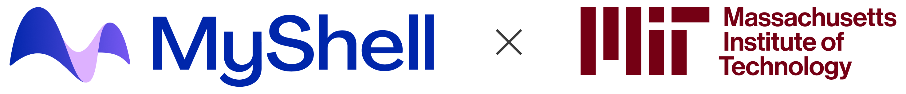

# JetMoE: Reaching LLaMA2 Performance with 0.1M Dollars

  
&nbsp;

   
   

## Key Messages

1. JetMoE-8B is trained with less than $ 0.1 million1 cost but outperforms LLaMA2-7B from Meta AI, who has multi-billion-dollar training resources. LLM training can be **much cheaper than people generally thought**.

2. JetMoE-8B is **fully open-sourced and academia-friendly** because:
    - It only uses public datasets for training, and the code is open-sourced. No proprietary resource is needed.
    - It can be finetuned with very limited compute budget (e.g., consumer-grade GPU) that most labs can afford.

3. JetMoE-8B only has 2.2B active parameters during inference, which drastically lowers the computational cost. Compared to a model with similar inference computation, like Gemma-2B, JetMoE-8B achieves constantly better performance.

1 We used a 96×H100 GPU cluster for 2 weeks, which cost ~$0.08 million.

## Authors

The project is contributed by [Yikang Shen](https://scholar.google.com.hk/citations?user=qff5rRYAAAAJ), [Zhen Guo](https://zguo0525.github.io/), [Tianle Cai](https://www.tianle.website/#/) and [Zengyi Qin](https://www.qinzy.tech/). For technical inquiries, please contact [Yikang Shen](https://scholar.google.com.hk/citations?user=qff5rRYAAAAJ). For media and collaboration inquiries, please contact [Zengyi Qin](https://www.qinzy.tech/).