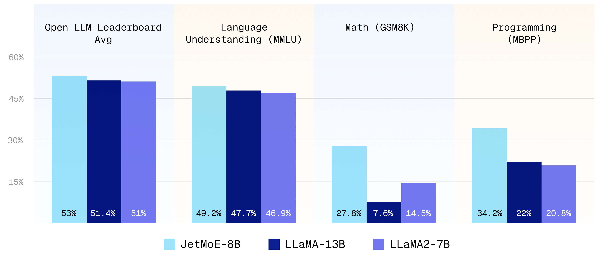

# JetMoE: Reaching LLaMA2 Performance with 0.1M Dollars

<div align="center">
  <div>&nbsp;</div>
   
   
</div>

## Key Messages

1. JetMoE-8B is **trained with less than $ 0.1 million**<sup>1</sup> **cost but outperforms LLaMA2-7B from Meta AI**, who has multi-billion-dollar training resources. LLM training can be **much cheaper than people previously thought**.

2. JetMoE-8B is **fully open-sourced and academia-friendly** because:
    - It **only uses public datasets** for training, and the code is open-sourced. No proprietary resource is needed.
    - It **can be finetuned with very limited compute budget** (e.g., consumer-grade GPU) that most labs can afford.

3. JetMoE-8B **only has 2.2B active parameters** during inference, which drastically lowers the computational cost. Compared to a model with similar inference computation, like Gemma-2B, JetMoE-8B achieves constantly better performance.

<sup>1</sup> We used a 96×H100 GPU cluster for 2 weeks, which cost ~$0.08 million.

Website: [https://research.myshell.ai/jetmoe](https://research.myshell.ai/jetmoe)

HuggingFace: [https://huggingface.co/jetmoe/jetmoe-8b](https://huggingface.co/jetmoe/jetmoe-8b)

Online Demo on Lepton AI: [https://www.lepton.ai/playground/chat?model=jetmoe-8b-chat](https://www.lepton.ai/playground/chat?model=jetmoe-8b-chat)

## Authors

The project is contributed by [Yikang Shen](https://scholar.google.com.hk/citations?user=qff5rRYAAAAJ), [Zhen Guo](https://zguo0525.github.io/), [Tianle Cai](https://www.tianle.website/#/) and [Zengyi Qin](https://www.qinzy.tech/). For technical inquiries, please contact [Yikang Shen](https://scholar.google.com.hk/citations?user=qff5rRYAAAAJ). For media and collaboration inquiries, please contact [Zengyi Qin](https://www.qinzy.tech/).

## Collaboration
**If you have great ideas but need more resources (GPU, data, funding, etc.)**, welcome to contact **MyShell.ai** via [Zengyi Qin](https://www.qinzy.tech/). **MyShell.ai** is open to collaborations and are actively supporting high-quality open-source projects.

## Benchmarks
We use the same evaluation methodology as in the Open LLM leaderboard. For MBPP code benchmark, we use the same evaluation methodology as in the LLaMA2 and Deepseek-MoE paper. The results are shown below:

|Model|Activate Params|Training Tokens|Open LLM Leaderboard Avg|ARC|Hellaswag|MMLU|TruthfulQA|WinoGrande|GSM8k|MBPP|HumanEval|
|---|---|---|---|---|---|---|---|---|---|---|---|
|Shot||||25|10|5|0|5|5|3|0|
|Metric||||acc_norm|acc_norm|acc|mc2|acc|acc|Pass@1|Pass@1|
|LLaMA2-7B|7B|2T|51.0|53.1|78.6|46.9|38.8|74|14.5|20.8|12.8|
|LLaMA-13B|13B|1T|51.4|**56.2**|**80.9**|47.7|39.5|**76.2**|7.6|22.0|15.8|
|DeepseekMoE-16B|2.8B|2T|51.1|53.2|79.8|46.3|36.1|73.7|17.3|34.0|**25.0**|
|Gemma-2B|2B|2T|46.4|48.4|71.8|41.8|33.1|66.3|16.9|28.0|24.4|
|JetMoE-8B|2.2B|1.25T|**53.0**|48.7|80.5|**49.2**|**41.7**|70.2|**27.8**|**34.2**|14.6|

| Model               | MT-Bench Score     |
|---------------------|-----------|
| GPT-4               | 9.014     |
| GPT-3.5-turbo       | 7.995     |
| Claude-v1           | 7.923     |
| **JetMoE-8B-chat**  | **6.681** |
| Llama-2-13b-chat    | 6.650     |
| Vicuna-13b-v1.3     | 6.413     |
| Wizardlm-13b        | 6.353     |
| Llama-2-7b-chat     | 6.269     |

To our surprise, despite the lower training cost and computation, JetMoE-8B performs even better than LLaMA2-7B, LLaMA-13B, and DeepseekMoE-16B. Compared to a model with similar training and inference computation, like Gemma-2B, JetMoE-8B achieves better performance.

## Model Usage
To load the models, you need install this package:
```
pip install -e .
```

Then you can load the model with the following code:
```python
from transformers import AutoTokenizer, AutoModelForCausalLM, AutoConfig, AutoModelForSequenceClassification
from jetmoe import JetMoEForCausalLM, JetMoEConfig, JetMoEForSequenceClassification

AutoConfig.register("jetmoe", JetMoEConfig)
AutoModelForCausalLM.register(JetMoEConfig, JetMoEForCausalLM)
AutoModelForSequenceClassification.register(JetMoEConfig, JetMoEForSequenceClassification)

tokenizer = AutoTokenizer.from_pretrained('jetmoe/jetmoe-8b')
model = AutoModelForCausalLM.from_pretrained('jetmoe/jetmoe-8b')
```

## Model Details
Please refer to [https://research.myshell.ai/jetmoe](https://research.myshell.ai/jetmoe) for model details and training details. We will also release the **technical report** soon.

## Acknowledgement
We express our gratitude to [Shengding Hu](https://shengdinghu.github.io/) for his valuable advice on the Phase 2 data mixture. We also express our gratitude to [Exabits](https://www.exabits.ai/) for their assistance in setting up the GPU clusters.
